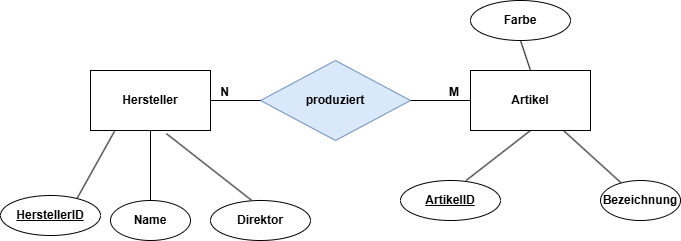
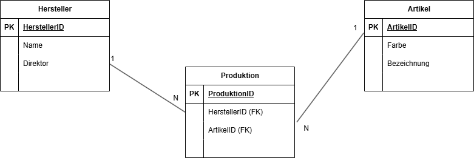
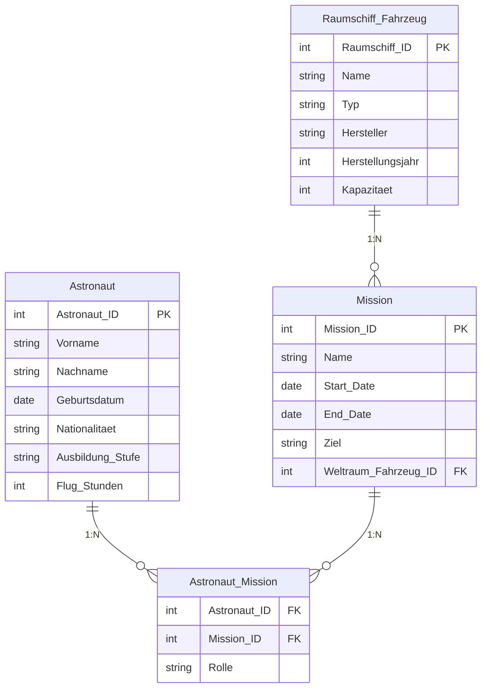
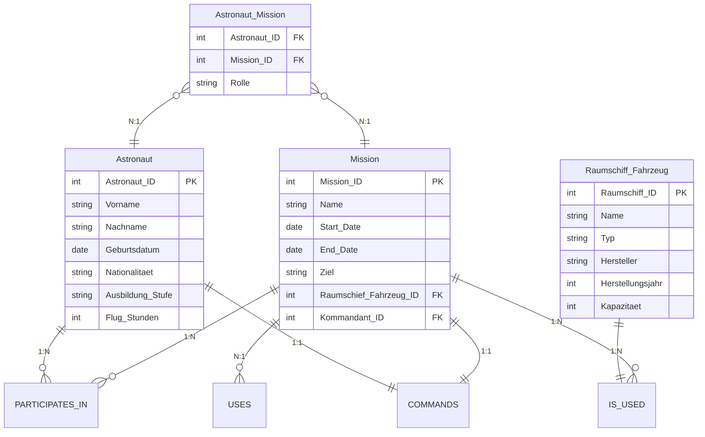

# Phasen des Designprozesses von relationalen Datenbanken

1.  **Analysephase (Ermittlung der Informationsstruktur)**
    Zunächst sind in einer Anforderungsanalyse die Anforderungen des Kunden an das zu entwickelnde Datenbanksystem zu ermitteln und zu strukturieren. Das Ergebnis dieser ersten Phase ist eine informelle Beschreibung des zu lösen den Problems.
2.  **Konzeptionelle Phase (Entwicklung eines konzeptionellen Modells)**
    Das Ziel der konzeptionellen Phase ist eine formalisierte Beschreibung des betrachteten Sach
    verhalts. Dazu gibt es mehrere Möglichkeiten. Der bekannteste Ansatz ist das ER-Modell.



Quelle: IT-Berufe, Westermann

3. **Logische Phase (Erstellung eines logischen Datenmodells)**

In dieser Phase wird das konzeptionelle Modell in ein relationales Datenmodell überführt.
Dabei werden zwei Schritte durchlaufen. Im ersten Schritt wird das ER-Modell in ein relationales Datenmodell überführt. Im zweiten Schritt erfolgt eine Optimierung des relationalen Datenmodells durch Normalisierung.



Quelle: IT-Berufe, Westermann

4.  **Implementationsphase (Erstellung der physischen Datenbank)**
    Am Ende dieser Phase sollte eine leere funktionstüchtige Datenbank existieren. Dazu wird das logische Modell mithilfe von SQL in ein konkretes Datenbankschema übersetzt. Im Zuge dessen müssen Datentypen, Wertebereiche, Relationen usw. festgelegt werden.

```sql
CREATE TABLE Hersteller (HNr INTEGER, Name VARCHAR(50), Direktor varchar(100), PRIMARY KEY(HNr));
```

**Aufgabe**

Überführen Sie das folgende ER-Modell in ein relationales Modell. Es muss noch nicht normalisiert werden.

1. **Analyze**

Es soll eine Datenbank für Astronauten, Missionen und Raumfahrzeuge modelliert werden. Für jede der Entitäten des Modells wurden in einem Interview mit einem NASA-Beamten die folgenden Informationen zu den Anforderungen gesammelt.

Astronauten, Missionen und Raumfahrzeuge werden in einer Datenbank gespeichert. Die folgenden Informationen über Astronauten sollten in die Datenbank aufgenommen werden.

**Astronaut**

- Vorname: Vorname des Astronauten.
- Nachname: Nachname des Astronauten.
- Geburtsdatum: Das Geburtsdatum des Astronauten.
- Nationalität: Nationalität des Astronauten.
- Ausbildung_Stufe: Bildungsgrad des Astronauten (Bachelor, Master, Promotion usw.).
- Flug_Stunden: Insgesamt im Weltraum verbrachte Zeit.
- Einsätze: Eine Liste der Missionen, an denen der Astronaut teilgenommen hat.

**Mission:**

- Name: Name des Missions.
- Start_Date: Startdatum des Einsatzes.
- End_Date: Enddatum des Einsatzes.
- Ziel: Der Himmelskörper oder die Region, auf die die Mission abzielt.
- Weltraum_Fahrzeug: ID (Fremdschlüssel) des für die Mission verwendeten Raumfahrzeugs.
- Crew: Eine Liste (mehrwertig) der IDs der an der Mission beteiligten Astronauten.
  
**Raumschiff_Fahrzeug:**

- Name: Name des Raumfahrzeugs.
- Typ: Typ des Raumfahrzeugs (Shuttle, Station, Sonde, usw.).
- Hersteller: Hersteller des Raumfahrzeugs.
- Herstellungsjahr: Produktionsjahr des Raumfahrzeugs.
- Kapazität: Beförderungskapazität des Raumfahrzeugs.

2. **Konzeptionalle Phase** ?


3. **Logische Phase** ?





