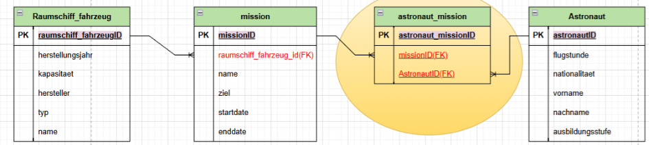

## **INNER JOIN Aufgaben**

1. **Liste alle Missionen und die Namen der zugehörigen Raumschiffe.**

  
 
2. **Zeige die Namen aller Astronauten zusammen mit den Missionen, an denen sie teilgenommen haben.**
   
3. **Liste alle Astronauten, die an Missionen teilgenommen haben, sortiert nach Nachnamen.**
   
4. **Zeige die Raumschiffe, die vor 1990 hergestellt wurden, zusammen mit den Missionen.**
  
5. **Finde alle Missionen, deren Ziel `NULL` ist.**
  
6. **Liste die Astronauten auf, deren Flugstunden in (`150, 200, 300`) liegen.**
  
7. **Finde alle Missionen, bei denen das Ziel "Space" enthält.**
   
8. **Liste alle Raumschiffe, die an Missionen beteiligt sind und nicht `NULL` als Typ haben.**
  
9. **Zeige alle Astronauten, deren Nachname mit "M" beginnt.**
   
10. **Zeige alle Missionen, die nach 2000 gestartet wurden, sortiert nach Startdatum.**
    
11. **Zeige alle Astronauten, die an Missionen teilgenommen haben, deren Startdatum `NULL` ist.**
 
12. **Finde alle Missionen, bei denen das Ziel nicht "Mars" ist.**
 
13. **Zeige die Astronauten, die NICHT an Missionen teilgenommen haben.**
 
14. **Liste alle Raumschiffe, deren Kapazität mehr als 10 beträgt, zusammen mit den Missionsnamen.**
 
15. **Zeige die Astronauten, die an Missionen teilgenommen haben und deren Flugstunden `NULL` sind.**
   
16. **Finde alle Missionen, bei denen kein Raumschiff zugeordnet ist.**
 
17. **Liste die Missionen und Astronauten, deren Flugstunden zwischen 200 und 400 liegen.**
  
18. **Zeige alle Missionen, die zwischen 2015 und 2020 gestartet wurden, zusammen mit den Astronauten.**
 
19. **Liste Astronauten und Missionen, deren Ziel "Jupiter" oder "Saturn" ist.**

# LEFT JOIN

- Liste aller Raumschiffe und ihrer zugehörigen Missionen Listen Sie alle Raumschiffe mit ihren Missionen auf. Zeigen Sie auch Raumschiffe an, die keiner Mission zugeordnet sind.

- Zeigen Sie alle Astronauten und die Namen der Missionen an, an denen sie teilnehmen. Astronauten ohne Mission sollen ebenfalls angezeigt werden.

- Listen Sie die Namen und Typen der Raumschiffe auf, die keiner Mission zugeordnet sind.

- Listen Sie die Namen und Ausbildungsstufen der Astronauten auf, die keiner Mission zugeordnet sind.

- Zeigen Sie die Namen der Missionen und die zugehörigen Raumschiffe an. Missionen ohne zugeordnetes Raumschiff sollen ebenfalls angezeigt werden.

- Listen Sie die Missionen und die Namen der daran teilnehmenden Astronauten auf. Missionen ohne Teilnehmer sollen ebenfalls angezeigt werden.
 