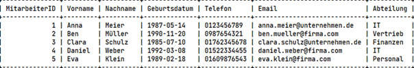
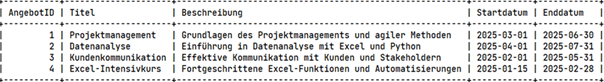

Herr Schuster hat folgende Anfrage gestellt:
"Wir benötigen eine Datenbank, die die Verwaltung von Weiterbildungsangeboten und Mitarbeiteranmeldungen erleichtert. Dabei sollen die folgenden Entitäten und Beziehungen enthalten sein:
•	Mitarbeiter-Attribute: MitarbeiterID, Vorname, Nachname, Geburtsdatum, Telefon, Email, Abteilung
•	Weiterbildungsangebot-Attribute: AngebotID, Titel, Beschreibung, Startdatum, Enddatum
Die Datenbank sollte uns helfen, alle Anmeldungen effizient zu verwalten und Informationen zu den Mitarbeitern und den Kursen jederzeit abrufbar zu machen."   

________________________________________
## 1. ERM-Modell erstellen
Erstellen Sie ein Entity-Relationship-Modell (ERM), das folgende Entitäten und Beziehungen mit Kardinalitäten enthält:
•	Mitarbeiter-Attribute: MitarbeiterID, Vorname, Nachname, Geburtsdatum, Telefon, Email, Abteilung
•	Weiterbildungsangebot-Attribute: AngebotID, Titel, Beschreibung, Startdatum, Enddatum
## 2. Datenbankmodell erstellen
Basierend auf dem ERM-Modell erstellen Sie ein Datenbankmodell, das die Tabellenstruktur beschreibt:
1.	Definieren Sie die notwendigen Tabellen mit den Attributen und deren Datentypen.
2.	Verwenden Sie Primär- und Fremdschlüssel, um die Datenbankstruktur korrekt und konsistent zu gestalten.

## 3. SQL-Skript erstellen 

Schreiben Sie ein SQL-Skript, um die Datenbank und Tabellen gemäß dem Datenbankmodell zu erstellen.

## 4. Daten in die Tabellen einfügen

Fügen Sie folgende Beispiel-Daten in die Tabellen ein:

## Mitarbeiter:

    +   Anna Meier (Abteilung: IT, Geburtsdatum: 1987-05-14, Telefon: 0123456789, Email: anna.meier@firma.com)
    -	Angebote: Projektmanagement, Datenanalyse

    +   Ben Müller (Abteilung: Vertrieb, Geburtsdatum: 1990-11-20, Telefon: 0987654321, Email: ben.mueller@firma.com)
    -   Angebote: Kundenkommunikation

    +   Clara Schulz (Abteilung: Finanzen, Geburtsdatum: 1985-07-10, Telefon: 01762345678, Email: clara.schulz@firma.com)
    - Angebote: Excel-Intensivkurs

    +   Daniel Weber (Abteilung: IT, Geburtsdatum: 1992-03-08, Telefon: 01522334455, Email: daniel.weber@firma.com)
    - Angebote: Projektmanagement

    +   Eva Klein (Abteilung: Personal, Geburtsdatum: 1989-02-18, Telefon: 01609876543, Email: eva.klein@firma.com)
    -	Angebote: Projektmanagement, Kundenkommunikation

## Weiterbildungsangebote:

    + Projektmanagement Beschreibung: Grundlagen des Projektmanagements und agiler Methoden
    	Startdatum: 2025-03-01
    	Enddatum: 2025-06-30
    + Datenanalyse
        Beschreibung: Einführung in Datenanalyse mit Excel und Python
        Startdatum: 2025-04-01
        Enddatum: 2025-07-31
    + Kundenkommunikation
        Beschreibung: Effektive Kommunikation mit Kunden und Stakeholdern
        Startdatum: 2025-02-01
        Enddatum: 2025-05-31
    +   Excel-Intensivkurs
        Beschreibung: Fortgeschrittene Excel-Funktionen und Automatisierungen
        Startdatum: 2025-01-15
        Enddatum: 2025-02-28

## 5. Schreiben Sie die SQL-Abfragen

a. Finden Sie alle Mitarbeiter, die für das Weiterbildungsangebot „Datenanalyse“ angemeldet sind.

b. Sortieren Sie die Liste der Mitarbeiter, die für das Weiterbildungsangebot „Projektmanagement“ angemeldet sind, in aufsteigender Reihenfolge nach Nachnamen.

c. Zeigen Sie die Titel der Weiterbildungsangebote und die Namen der angemeldeten Mitarbeiter an.

d. Finden Sie alle Mitarbeiter, deren E-Mail-Adresse mit „firma.com“ endet.
