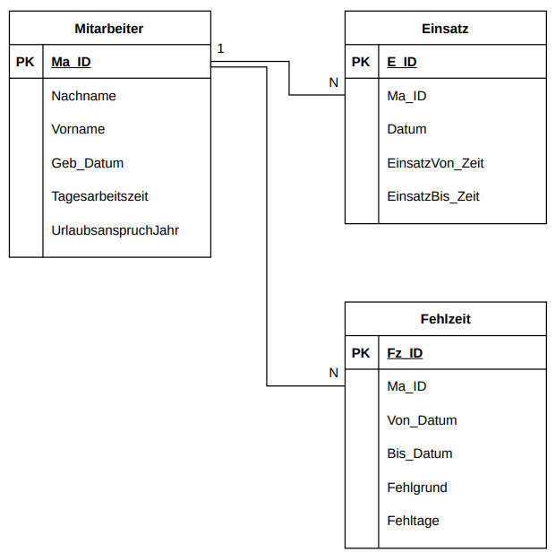

## Beispiel 1

### Analysephase

Es soll eine relationale Datenbank erstellt werden, mit deren Hilfe die Bücher einer Bibliothek und die Verleihungsvorgänge verwaltet werden. Folgende Daten soll die Datenbank enthalten:

• Kunde: Kundennummer, Nachname, Vorname, Adresse, Telefonnummer
• Buch: Titel, ISBN, Auflage, Verlag, Verlagsnummer, Buchnummer, Anschaffungsdatum
• Verleihvorgang: Buchnummer, Kundennummer, Ausleihdatum, Rückgabedatum

- Entwickle ein ER-Modell
- Ableite ein relationales Modell (nicht normalisiert)

## Beispiel 2

## Beispiel 3

Übung: Mitarbeiter
Die Personalabteilung hat festgestellt, dass folgende
Informationen/Funktionen besonders häufig benötigt werden. Im Rahmen des Projektes werden Sie mit der Erstellung von entsprechenden SQL-Anweisungen beauftragt.

1. Erstellen Sie eine SQL-Anweisung, mit der die Anzahl der Mitarbeiter/-innen zurückgegeben wird, die weniger als 7,33 Stunden pro Tag arbeiten.
2. Erstellen Sie eine SQL-Anweisung, mit der für jede/-n Mitarbeiter/-in die Anzahl der Fehltage nach Fehlgrund zusammengefasst und ausgeben werden.
3. Erstellen Sie eine SQL-Anweisung, welche die Einsatzzeiten aller Mitarbeiter/-innen im April 2009 (in Stunden) ermittelt.
   Ma_ID Nachname Einsatzzeit
   811 Müller 08:28:00
   902 Sorge 04:45:00 4. Erstellen Sie eine SQL-Anweisung, welche den Resturlaub aller
   Mitarbeiter/-innen für das Jahr 2009 berechnet.
   Ma_ID Nachname Resturlaub
   811 Müller 21
   902 Sorge 29 5. Erstellen Sie eine SQL-Anweisung, die alle Mitarbeiter/-
   innen, deren Nachname mit „Sch“ beginnt und die im laufenden
   Jahr älter als 30 Jahre sind, dem Alter nach aufsteigend
   sortiert. Sollten mehr als ein Mitarbeiter/-in am gleichen
   Tag Geburtstag haben, soll nach Nachname sortiert werden.
   Nachname Vorname Alter
   Scholz Birgit 57 Schmidt Ulrich 64 6. Frau Birgit Scholz arbeitet ab sofort sieben Stunden pro Tag. Erstellen Sie eine SQL-Anweisung, mit der die Änderung in der Datenbank vorgenommen wird.
