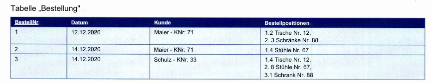
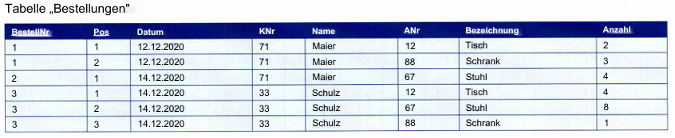
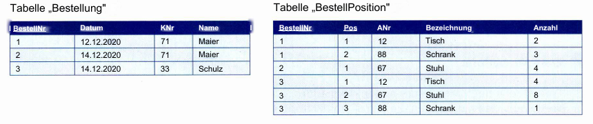
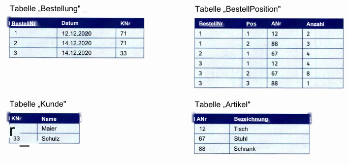
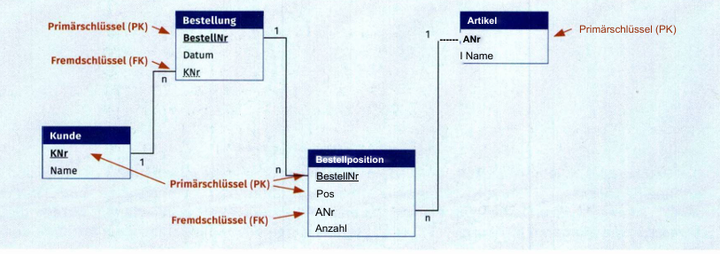

# **Normalisierung von Datenbanken**

## **Einleitung: Warum ist Normalisierung wichtig?**

Die Normalisierung ist ein zentraler Aspekt der Datenbankentwicklung, insbesondere im Kontext relationaler Datenbanken. Sie verfolgt das Ziel:
1. **Redundanzen zu minimieren**, um unnötige Wiederholungen von Daten zu vermeiden.
2. **Anomalien** (Einfüge-, Änderungs- und Löschanomalien) zu verhindern, die durch inkonsistente oder doppelt gespeicherte Daten entstehen können.
3. **Datenintegrität** sicherzustellen und die Datenbank konsistent zu halten.

Normalisierung ist sowohl in der Praxis als auch in Prüfungen ein grundlegendes Thema. Entwicklerinnen und Entwickler werden oft mit Aufgaben konfrontiert, die den Umgang mit Normalisierung in Theorie und Praxis prüfen.

---

## **Die drei Normalformen**

### **1. Erste Normalform (1NF)**

**Definition:** Eine Tabelle befindet sich in der ersten Normalform, wenn:
- Alle Zellen atomare Werte enthalten (jede Zelle hat genau **einen Wert** und keine Listen oder zusammengesetzten Daten).
- Keine Wiederholungsgruppen vorhanden sind.

**Beispiele für Probleme in der 1NF:**
- Mehrere Artikel in einer Bestellung werden in einer Zelle gespeichert (z. B. „Artikel: 1, 2, 3“).
- Adressen sind nicht atomar (z. B. „Berliner Straße 1, Köln“ enthält Straße, Hausnummer, Postleitzahl und Stadt in einer Zelle).

**Lösung:**
- Nicht-atomare Werte werden in einzelne Spalten aufgeteilt (z. B. Straße, Hausnummer, Postleitzahl und Stadt in separate Spalten).
- Wiederholungsgruppen werden in neue Zeilen umgewandelt. Eine Bestellung mit mehreren Artikeln wird auf mehrere Zeilen verteilt, sodass jede Zeile nur **einen Artikel** repräsentiert.

**Resultat:**
- Die Tabelle enthält ausschließlich atomare Werte.
- Redundanzen können jedoch in dieser Phase entstehen, da Daten (wie Kundennamen) möglicherweise mehrfach vorkommen.

---

### **2. Zweite Normalform (2NF)**

**Definition:** Eine Tabelle befindet sich in der zweiten Normalform, wenn:
1. Sie sich in der ersten Normalform befindet.
2. Alle Nicht-Schlüssel-Attribute vollständig vom gesamten Primärschlüssel abhängen.

**Probleme der 1NF in Bezug auf die 2NF:**
- Daten (z. B. Kundenname und Adresse) hängen nur von einem Teil des zusammengesetzten Primärschlüssels ab und nicht von der gesamten Kombination (z. B. „Kundennummer“ und „Bestellnummer“).

**Lösung:**
- Daten, die nur von einem Teil des Schlüssels abhängen, werden in separate Tabellen verschoben. Zum Beispiel:
  - Eine **Kundentabelle** mit Kundennummer, Name, Adresse usw.
  - Eine **Bestellungstabelle**, die Bestellungen und die zugehörigen Artikel verwaltet.

**Resultat:**
- Es gibt keine Teilschlüsselabhängigkeiten mehr.
- Redundanzen werden reduziert, da z. B. Kundendaten nur einmal gespeichert werden.

---

### **3. Dritte Normalform (3NF)**

**Definition:** Eine Tabelle befindet sich in der dritten Normalform, wenn:
1. Sie sich in der zweiten Normalform befindet.
2. Keine transitiven Abhängigkeiten existieren (Attribute hängen nur direkt vom Primärschlüssel ab und nicht indirekt über andere Nicht-Schlüssel-Attribute).

**Probleme der 2NF in Bezug auf die 3NF:**
- Daten wie „Rabatt“ hängen möglicherweise von der „Artikelgruppe“ ab, nicht direkt vom Artikel selbst. Dies führt zu einer transitiven Abhängigkeit: Artikel → Artikelgruppe → Rabatt.

**Lösung:**
- Transitiven Abhängigkeiten werden durch die Einführung neuer Tabellen eliminiert:
  - Eine Tabelle für **Artikelgruppen**, die den Rabatt enthält.
  - Die Artikeltabelle verweist über einen Fremdschlüssel auf die Artikelgruppe.

**Resultat:**
- Die Daten sind konsistent und vollständig normalisiert.
- Jede Information ist genau einmal gespeichert, und Änderungen betreffen nur die relevante Tabelle.

---

## **Zusammenfassung der Normalisierungsstufen**

| **Normalform**     | **Kriterien**                                                                 |
|---------------------|------------------------------------------------------------------------------|
| **1. Normalform**   | - Nur atomare Werte   - Keine Wiederholungsgruppen                       |
| **2. Normalform**   | - 1NF erfüllt   - Alle Nicht-Schlüssel-Attribute hängen vom gesamten Primärschlüssel ab |
| **3. Normalform**   | - 2NF erfüllt   - Keine transitiven Abhängigkeiten                      |

---

## **Vorteile der Normalisierung**

1. **Vermeidung von Redundanzen:** Jede Information wird nur einmal gespeichert.
2. **Schutz vor Anomalien:** Einfüge-, Änderungs- und Löschanomalien werden verhindert.
3. **Bessere Datenkonsistenz:** Änderungen an Daten wirken sich systemweit korrekt aus.
4. **Flexibilität:** Die Abfrage und Verarbeitung von Daten wird durch die strukturierte Aufteilung erleichtert.

---

## **Praktische Anwendung**

In der Praxis beginnt die Normalisierung oft mit einer nicht normalisierten Excel-Tabelle, die viele redundante Daten und Abhängigkeiten enthält. Durch die systematische Anwendung der Normalisierungsschritte (1NF, 2NF, 3NF) entsteht eine konsistente und performante Datenbankstruktur.

**Beispiel:**
- Ein Kunde ändert seinen Namen (z. B. nach einer Heirat). In einer normalisierten Datenbank erfolgt diese Änderung nur an einer Stelle (z. B. in der Kundentabelle). In einer nicht normalisierten Datenbank müsste die Änderung an mehreren Stellen erfolgen, was zu Fehlern führen kann.

---

## **Fazit**

Die Normalisierung ist eine Methodik, um relationale Datenbanken effizient, konsistent und fehlerfrei zu gestalten. Sie eliminiert Redundanzen und verhindert Anomalien, sodass eine saubere und wartbare Datenstruktur entsteht. In der Praxis ist die dritte Normalform meist ausreichend, da sie die gängigsten Probleme löst, ohne die Komplexität unnötig zu erhöhen.

# Aufgabe **Datenbanknormalisierung**

## Erste Normalform (1. NF)
 Die Beispieltabelle entspricht noch nicht der 1. NF, da sowohl in der Spalte „Kunde" als auch in der Spal te „Bestellpositionen" eine Aufzählung von Werten zu finden ist. Um die Tabelle in die 1. NF zu überfüh ren, wird für jeden Wert, der in den Aufzählungen vorkommt, eine neue Spalte angelegt. Dazu wird die Spalte „Kunde“ in die Spalten ,,Name"(Kundenname) und ,,KNr"(KundenNr.) aufgeteilt. Aus der Spalte „Bestellpositionen" entstehen die Spalten „Pos“ (Bestellposition),„Anzahl",„Bezeichnung"(Artikelbezeichnung) und „ANr“ (ArtikelNr.). Die Spalte „BestellNr" ist in der neuen Tabelle nicht mehr eindeutig und wird um die Spalte „Pos" erweitert. Somit ergibt sich der Primärschlüssel aus den Spalten „BestellNr" und „Pos", erkennbar an der Unterstreichung. Die Beispieltabelle sieht in der 1. NF wie folgt aus:

 

 Diese Tabelle enthält trotz erster Normalform noch viele Redundanzen. Redundanzen sind etwa in den Spalten „Datum", „KNr", „Name", „ANr" und „Bezeichnung" erkennbar, die durch die nächsten Normalisierungsschritte beseitigt werden.
 ## Zweite Normalform (2. NF)
 **Eine Tabelle liegt dann in der zweiten Normalform vor, wenn sie der ersten Normalform genügt und alle Nichtprimärschlüsselattribute vom gesamten Primärschlüssel abhängig sind.**

 Die zweite Normalform wird angewendet, wenn eine Tabelle einen zusammengesetzten Primärschlüssel besitzt. Die Beispieltabelle liegt nicht in der 2. NF vor, da **die Attribute „Datum", „KNr" und „Name" nur vom Attribut „BestellNr“**, also nicht vom gesamten Primärschlüssel abhängig sind. Auch das Datum einer Bestellung kann ermittelt werden, wenn man nur die „BestellNr" kennt. Um einen bestimmten Artikel einer Bestellung zu ermitteln, sind beide Angaben des Primärschlüssels erforderlich, also „BestellNr" und „Pos“. Die Tabelle wird in die 2. NF überführt, indem alle Attribute in eine neue Tabelle ausgelagert werden, die nur von einem Teil des Primärschlüssels abhängig sind. Auf diese Weise entstehen in unserem Beispiel zwei Tabellen, die durch eine 1 :n-Beziehung über die „BestellNr“ miteinander verknüpft sind.

 

 ## Dritte Normalform (3. NF)

 **Eine Tabelle liegt dann in der dritten Normalform vor, wenn sie der zweiten Normalform genügt und kein Nichtschlüsselattribut transitiv abhängig ist.**

  Transitive Abhängigkeiten sind vermittelte oder berechnete Abhängigkeiten, die z. B. zwischen dem Nettopreis und dem Bruttopreis bei eindeutigem Mehrwertsteuersatz bestehen. Die beiden erzeugten Beispieltabellen befinden sich nicht in der 3. NF, da sie transitive Abhängigkeiten enthalten. In der Tabelle „Bestellung" sind „KNr" und „Name" voneinander abhängig. In der Tabelle „BestellPosition" besteht Ab

 

 