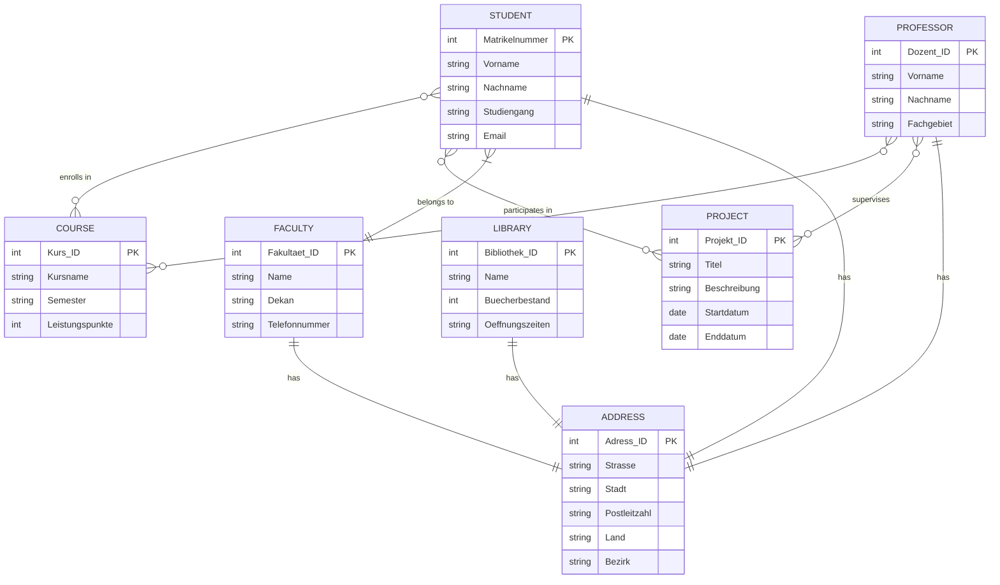

# Universitätmodell

Überführen Sie das folgende ER-Modell in ein relationales Modell. Es muss noch nicht normalisiert werden.

### Analyse

Es wurde eine Datenbank für Studierende, Kurse, Dozenten, Fakultäten, Bibliotheken, Projekte und Adressen basierend auf einer Reihe von Gesprächen mit einem Universitätsvertreter und Dozenten entwickelt. Während der Interviews wurden die folgenden Anforderungen und Schlüsselaspekte definiert:

- Studierende können sich für mehrere Kurse einschreiben, und ein Kurs kann mehrere eingeschriebene Studierende haben.
- Ein Kurs kann von mehreren Dozenten unterrichtet werden, und ein Dozent kann mehrere Kurse lehren. Diese Beziehung sollte in der Datenbank abgebildet werden.
- Studierende gehören zu einer bestimmten Fakultät, die für ihren Studiengang zuständig ist.
- Projekte werden von Dozenten betreut und von Studierenden durchgeführt.
- Jede Person hat eine Adresse. Eine Adresse gehört nur einer Person. Die Fakültät hat auch eine Addresse.

Die folgenden Entitäten und Attribute wurden auf Grundlage dieser Gespräche definiert:

**Studierende**

Matrikelnummer: Eindeutige Identifikationsnummer des Studierenden.
Vorname: Vorname des Studierenden.
Nachname: Nachname des Studierenden.
Studiengang: Studienrichtung des Studierenden (z. B. Informatik, Maschinenbau).
E-Mail-Adresse: Universitäre E-Mail-Adresse des Studierenden.
Hinweis: Studierende können sich für mehrere Kurse einschreiben und sind bestimmten Fakultäten zugeordnet.

**Kurs**

Kurs_ID: Eindeutige Identifikationsnummer des Kurses.
Kursname: Name des Kurses.
Semester: Das Semester, in dem der Kurs angeboten wird.
Leistungspunkte: Anzahl der Credits, die für den Abschluss des Kurses vergeben werden.
Hinweis: Ein Kurs kann von mehreren Dozenten unterrichtet werden und hat mehrere Studierende, die daran teilnehmen. Dies sollte bei der Modellierung berücksichtigt werden.

**Dozent**

Dozent_ID: Eindeutige Identifikationsnummer des Dozenten.
Vorname: Vorname des Dozenten.
Nachname: Nachname des Dozenten.
Fachgebiet: Spezifisches Fachgebiet des Dozenten (z. B. Künstliche Intelligenz, Mathematik).
Hinweis: Dozenten können mehrere Kurse lehren und Projekte betreuen.

**Fakultät**

Fakultät_ID: Eindeutige Identifikationsnummer der Fakultät.
Name: Name der Fakultät (z. B. Naturwissenschaften, Ingenieurwissenschaften).
Dekan: Name des aktuellen Dekans der Fakultät.
Telefonnummer: Kontakttelefonnummer der Fakultät.
Hinweis: Studierende gehören zu einer Fakultät, und Dozenten arbeiten oft in bestimmten Fakultäten.

**Bibliothek**

Bibliothek_ID: Eindeutige Identifikationsnummer der Bibliothek.
Name: Name der Bibliothek.
Bücherbestand: Anzahl der Bücher, die in der Bibliothek verfügbar sind.
Öffnungszeiten: Die regulären Öffnungszeiten der Bibliothek.
Hinweis: Jede Bibliothek ist an einem bestimmten Standort der Universität.

**Projekt**

Projekt_ID: Eindeutige Identifikationsnummer des Projekts.
Titel: Der Titel des Projekts.
Beschreibung: Kurze Beschreibung des Projekts.
Startdatum: Das Startdatum des Projekts.
Enddatum: Das voraussichtliche Enddatum des Projekts.
Hinweis: Projekte werden von Dozenten betreut und haben teilnehmende Studierende.

**Adresse**

Adress_ID: Eindeutige Identifikationsnummer der Adresse.
Straße: Straßenname und Hausnummer.
Stadt: Stadt, in der sich die Adresse befindet.
Postleitzahl: Postleitzahl der Adresse.
Land: Land, in dem sich die Adresse befindet.
Bezirk: Der Bezirk oder das Stadtviertel.
Hinweis: Adressen werden Studierenden, Dozenten und Bibliotheken zugeordnet.

### Konzeptionalle Phase

Basierend auf den Anforderungen und Gesprächen mit dem Kunden sollte das ER-Modell erstellt werden, um die Beziehungen zwischen den Entitäten zu verdeutlichen. Überlegen Sie sich, wie die viele-zu-viele-Beziehung zwischen Dozenten und Kursen sowie zwischen Studierenden und Kursen modelliert werden kann.

### Logische Phase

Überführen Sie das ER-Modell in ein relationales Modell und erstellen Sie die Tabellenstrukturen mit der Identifikation von Primär- und Fremdschlüsseln, die aus den im Text gegebenen Hinweisen abgeleitet werden können.

