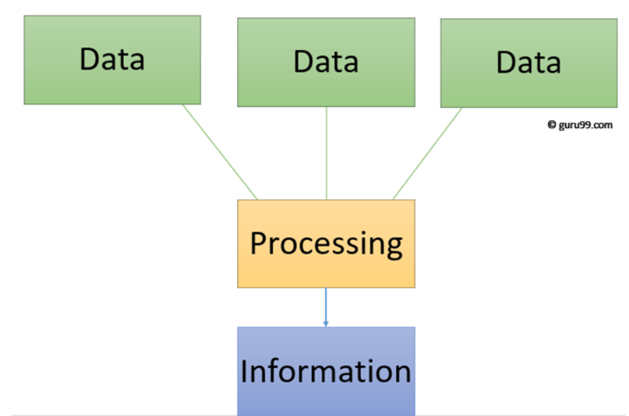
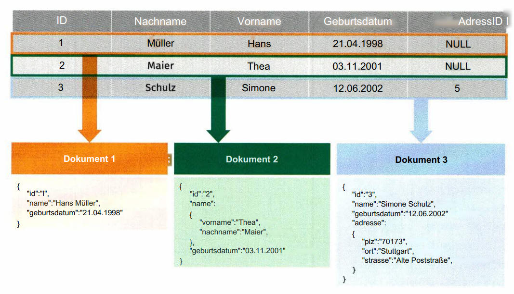
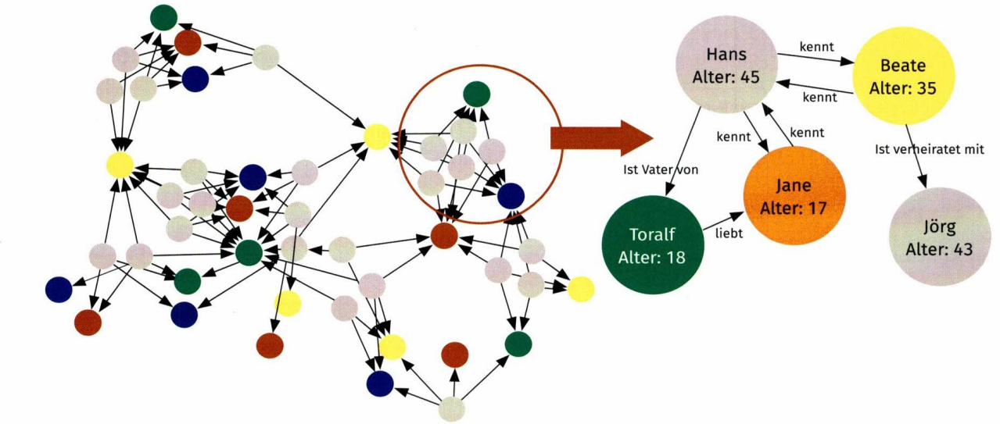
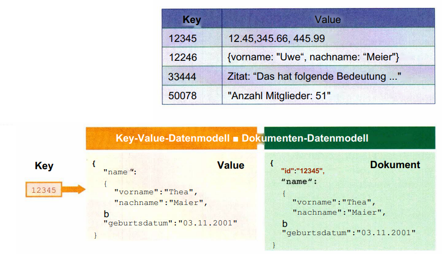
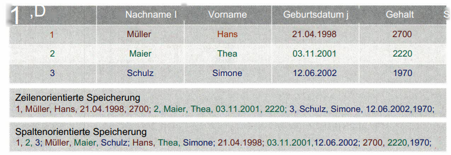

## Was ist eine Datenbank?

### Daten und Information

- Daten: Daten sind die **rohen, unverarbeiteten** Fakten, Beobachtungen, Messwerten und Zahlen, die gesammelt werden. Es sind die Bausteine, aus denen Informationen entstehen.

- Information: Information entsteht, wenn diesen Daten **ein Kontext** gegeben wird.

- Daten sind die Grundlage, Information ist der Sinn. Ohne Daten können wir keine Informationen gewinnen, und ohne Informationen sind Daten nutzlos.

#### Beispiel

- Eine Liste von Zahlen: **[1, 2, 3, 4, 5]**. Das sind Daten. Sie haben an sich noch keine Bedeutung.

- Die gleichen Zahlen **[1, 2, 3, 4, 5]** könnten beispielsweise die Anzahl der Äpfel sein, die Sie in fünf Tagen gegessen haben. In diesem Kontext geben die Zahlen eine Information über Ihren Apfelkonsum.

https://www.youtube.com/watch?v=9Mrg9A2jBSM

### Datenbank

- **Datenbank**: Eine Datenbank ist eine organisierte Sammlung von strukturierten Informationen oder Daten, die typischerweise elektronisch in einem Computersystem gespeichert sind. (Oracle)

### Datenbankenarten

**Unterschied zwischen SQL und NoSQL**

| Relationale Datenbank                                  | NoSQL                                                            |
| ------------------------------------------------------ | ---------------------------------------------------------------- |
| vertikal skaliert                                      | horizontal skaliert                                              |
| strukturierte Daten:festgelegte Datentyp und -struktur | Flexibel; semi-, un- oder strukturierte Daten ohne Konvertierung |
| ACID\*:Atomicity,Consistency, Isolation, Durability    | BASE\*:Basically Available,Soft State, Eventually Consistent     |
| SQL                                                    | Keine einheitlicheAbfragesprache                                 |
| populäre DBMS: MySQL, PostGreSql, Oracle,MS-SQL        | MongoDB, Cassandra,Redis,Elasticsearch                           |

https://www.youtube.com/watch?v=kvLbRit22AM

#### NoSQL Datenbanken

##### Dokumentorientierte Datenbank

- MongoDB

##### Graphdatenbank

##### Key-Value-Datenbank

##### Spaltenorientiert Datenbank

