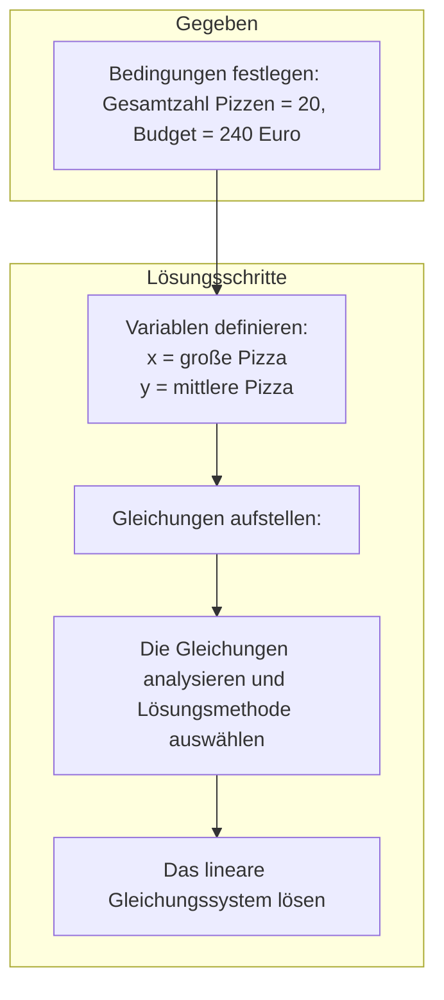

# Lineare Gleichungssyteme

## Gleichsetzungsverfahren

- **Umformen**:

Wähle eine der beiden Variablen (z.B. x) aus und stelle beide Gleichungen so um, dass diese Variable alleine auf einer Seite steht.

- **Gleichsetzen**:

Da beide Gleichungen nun nach derselben Variablen umgestellt sind, können die rechten Seiten der Gleichungen gleichgesetzt werden.

- **Lösen**:

Die entstandene Gleichung enthält nur noch eine Unbekannte. Löse diese Gleichung nach der verbleibenden Variablen auf.

- **Einsetzen**:

Setze den gefundenen Wert in eine der ursprünglichen Gleichungen ein und berechne den Wert der anderen Variablen.

https://studyflix.de/mathematik/gleichsetzungsverfahren-2318

### Beispiel

Gegeben sei das folgende Gleichungssystem:

$$
I:   2x + y = 7 \\
II:  x - y = 2
$$

#### Gleihsetzungsverfahren

- Umformen:

  $$
  I':   y = 7 -2x \\
  II':  y = x-2
  $$

- Gleichsetzen:

$$
I' =II' \\
7 -2x = x-2
$$

- Lösen :

  $$
  7 -2x = x-2 \\
  9=3x \\
  x=3
  $$

- Einsetzen:

$$
II:  x - y = 2 => 3-y=2 => y=1
$$

**Übung:** s.112 2-a

## Einsetzungsverfahren

- Eine Gleichung umstellen:

Wähle eine Gleichung aus und stelle sie nach einer Variablen (z.B. x oder y) um. Das heißt, isolier diese Variable auf einer Seite der Gleichung.

- Einsetzen:

Nimm den Ausdruck, den du in Schritt 1 erhalten hast, und setze ihn für die entsprechende Variable in die andere Gleichung ein. Dadurch erhältst du eine Gleichung mit nur noch einer Unbekannten.

- Lösen:

Löse die Gleichung aus Schritt 2 nach der verbliebenen Variablen auf.

- Rückwärts einsetzen:

Setze den gefundenen Wert in eine der ursprünglichen Gleichungen ein und berechne den Wert der anderen Variablen.

https://studyflix.de/mathematik/einsetzungsverfahren-2317

### Bespiel

- Umstellen:

Gleichung II nach x umstellen:

$$
x = y + 2
$$

- Einsetzen:

x in Gleichung 1 einsetzen:

$$2(y + 2) + y = 7$$

- Lösen:

Gleichung lösen:

$$3y + 4 = 7 => y = 1$$

- Rückwärts einsetzen:

y = 1 in x = y + 2 einsetzen:

$$x = 1 + 2 = 3$$
Lösung:

Das Gleichungssystem hat die Lösung x = 3 und y = 1.

**Übung**: s.112 2-b

## Additionsverfahren

- Vorbereitung:

Stelle sicher, dass die Gleichungen in einer übersichtlichen Form vorliegen (z.B. alle Terme mit x auf einer Seite, alle Terme mit y auf der anderen Seite und die konstanten Terme auf der rechten Seite).

- Koeffizienten anpassen:

Multipliziere eine oder beide Gleichungen mit geeigneten Zahlen, sodass die Koeffizienten einer Variablen in beiden Gleichungen entgegengesetzt gleich sind (z.B. +2x und -2x). Dadurch heben sich diese Terme beim Addieren auf.

- Addieren:

Addiere die beiden Gleichungen Glied für Glied.

- Lösen:

Löse die entstandene Gleichung nach der verbleibenden Variablen auf.

- Einsetzen:

Setze den gefundenen Wert in eine der ursprünglichen Gleichungen ein und berechne den Wert der anderen Variablen.

https://studyflix.de/mathematik/additionsverfahren-2319

### Beispiel

- Vorbereitung:

Die Gleichungen sind bereits in der richtigen Form.

- Koeffizienten anpassen:

Da die Koeffizienten von y bereits entgegengesetzt gleich sind (+y und -y), können wir direkt zum nächsten Schritt übergehen.

- Addieren:

Addiere die beiden Gleichungen:
$$(2x + y) + (x - y) = 7 + 2 => 3x = 9$$

- Lösen:

Löse nach x auf: $$4x = 3$$

- Einsetzen:

Setze x = 3 in Gleichung I ein:

$$2*3 + y = 7 => y = 1$$

- Lösung:

Das Gleichungssystem hat die Lösung x = 3 und y = 1.

**Übung:** s.112 2-c

## Überprüfung der Richtigkeit der Lösung

Wenn die Lösung gefunden und in die Gleichung eingesetzt wird, **erfüllt sie beide Gleichungen**.

## Geometrische Bedeutung der Lösung

Wenn du zwei solche Geraden in ein Koordinatensystem zeichnest, gibt es drei mögliche Fälle:

- **Ein Schnittpunkt**: Die beiden Geraden schneiden sich in genau einem Punkt. Dieser Punkt ist die Lösung des Gleichungssystems, da seine Koordinaten beide Gleichungen erfüllen.
- **Keine Schnittpunkte**: Die beiden Geraden sind parallel und schneiden sich nicht. Das Gleichungssystem hat dann keine Lösung.
- **Unendlich viele Schnittpunkte**: Die beiden Geraden fallen zusammen. Das bedeutet, jeder Punkt auf der Geraden ist eine Lösung, und das Gleichungssystem hat unendlich viele Lösungen.

## Aufgabe
„Stellt euch vor, wir planen eine Pizza-Party in der Klasse! 
Wir haben ein Budget von 240 € und können insgesamt 20 Pizzen bestellen. 
Große Pizzen kosten 15 € und mittlere 10 €. 
Was denkt ihr: Wie viele große und wie viele mittlere Pizzen sollten wir bestellen?“

I. x + y = 20 
        II. 15x + 10y = 240
