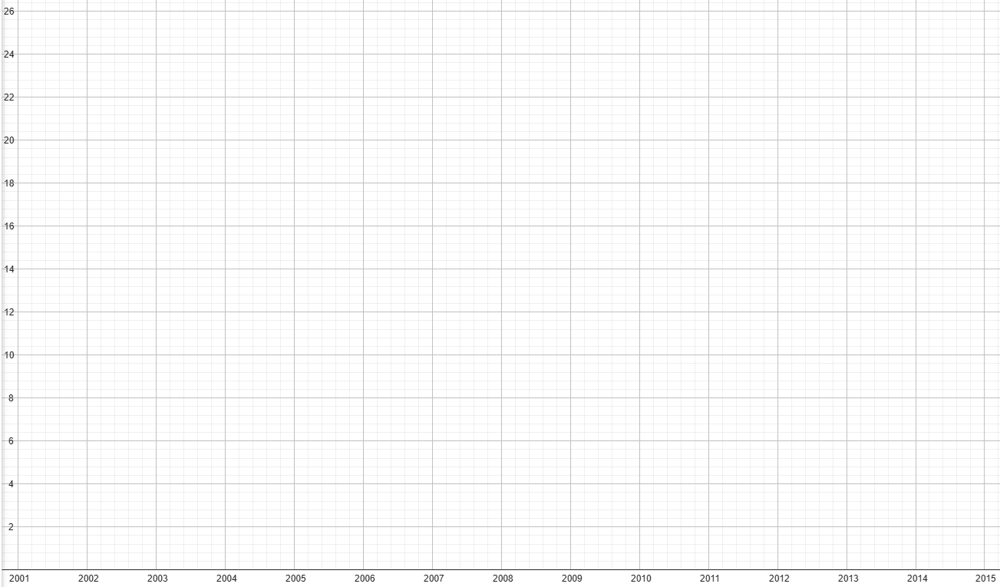
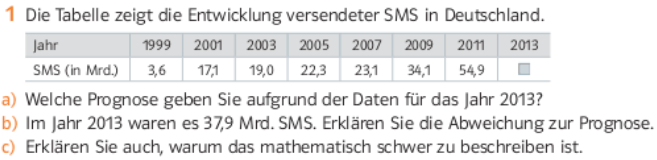
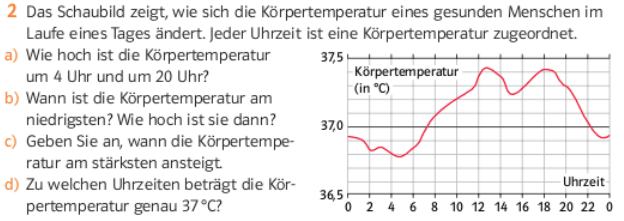

# Zusammenhänge darstellen und interpretieren
## Aufgabe 1: 
Die Tabelle zeigt den Anteil der erneuerbaren Energien am Brutto-Stromverbrauch in Deutschland in den Jahren 2003 bis 2013.

||||||||
|---|---|---|---|---|---|---| 
|Jahr|2003|2005|2007|2009|2011|2013|
|Anteil(in %)|7|10|14|16|20|24|
- Veranschaulichen Sie die Daten in einem Schaubild.
- Welche Entwicklung ist langfristig zu erwarten?

## Aufgabe 2

## Aufgabe 3

