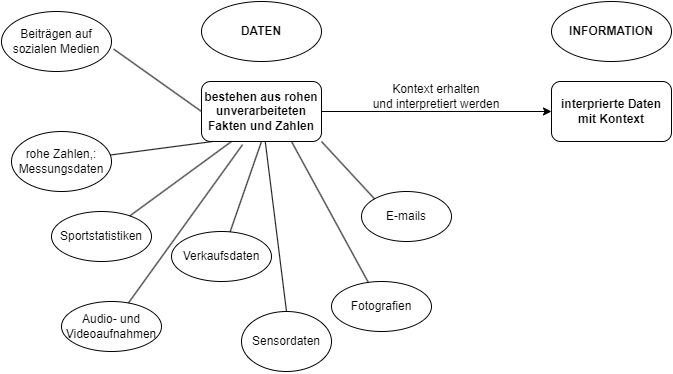

# Definitionen

- Software: Ein Sammelbegriff für Computerprogramme und die zugehörigen Daten, um bestimmte Aufgaben mithilfe eines Rechners zu bearbeiten oder Probleme zu lösen.

## Daten - Information

- Daten: **Rohe Fakten**, die noch nicht interpretiert/verarbeitet wurden. Sie sind die Grundlage für die Verarbeitung durch Computer.

- Information: Information entsteht, wenn Daten **einen Kontext** erhalten und interpretiert werden. Sie ist der Sinn, den wir aus Daten ziehen.

- z.B.: Die täglichen Temperaturdaten der letzten 100 Jahre sind in ihrer Gesamtheit schwer zu verstehen und geben nur Auskunft über die Temperaturen an bestimmten Tagen. Dank der mit ökonometrischen Methoden erstellten Modelle lassen sich jedoch Informationen über mögliche Temperaturveränderungen in der Zukunft gewinnen.

## Das Umfeld der Softwareentwicklung

### Begriffe im Umfeld der SE

- **Datenbank:** Eine Datenbank ist eine organisierte Sammlung von Daten, die effizient gespeichert und abgerufen werden können. Im Arbeitsleben werden SQL-Datenbanken zur Speicherung strukturierter Daten verwendet.
- **DevOps-Entwickler/Ingenieur:** Ein Devops Ingenieur ist ein IT-Generalist, der über weitreichende Kenntnisse in **Entwicklung** und **Betrieb** verfügen sollte, einschließlich Programierung, Infrastrukturmanagement, Systemadministration und DevOps-Tools.

