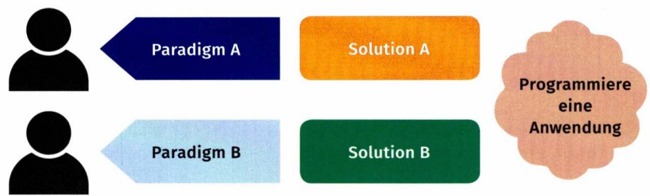
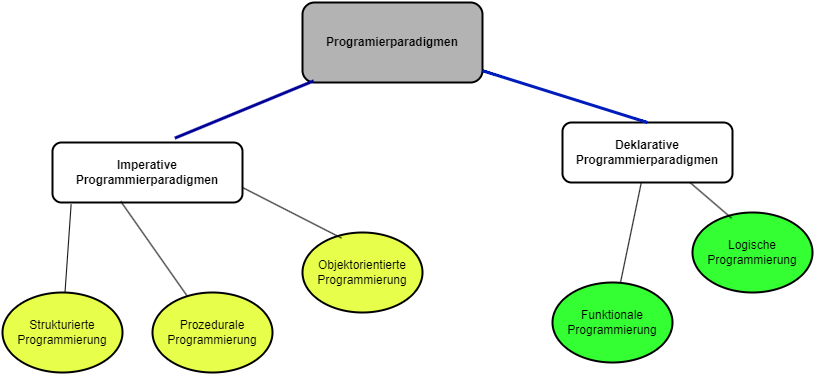
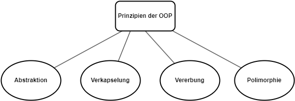

## Programmiersprache

- Eine Programmiersprache ist eine **künstliche, präsize** und **detaillierte** Sprache, um **die Anweisungen an einen Computer zu übermitteln**.

### Warum brauchen wir Programmiersprachen?

- **Computer verstehen nur Maschinencode**: Computer verstehen nur eine sehr einfache Sprache, die aus **Nullen** und **Einsen** besteht (Maschinencode). Programmiersprachen dienen als Brücke zwischen menschlicher Logik und dem Maschinencode.
- **Automatisierung**: Mit Programmiersprachen können wir Aufgaben automatisieren, die für Menschen langweilig oder zeitaufwendig sind.
- **Kreativität**: Programmieren ist wie das Bauen mit digitalen Legosteinen. Man kann damit unglaublich kreative Dinge erschaffen, von einfachen Websites bis hin zu komplexen Computerspielen.

### Wie funktioniert das?

**Schreiben des Codes**: Der Programmierer schreibt den Code, also die Anweisungen, in einer bestimmten Programmiersprache.
**Übersetzung**: Ein **_Compiler_** oder **_Interpreter_** übersetzt diesen Code in Maschinencode, den der Computer versteht.
**Ausführung**: Der Computer führt die Anweisungen aus dem Maschinencode aus.

### Beispiele für Programmiersprachen:

- **Python**: Bekannt für ihre einfache Syntax, eignet sie sich gut für Einsteiger und wird für viele Anwendungen eingesetzt.
- **Java**: Eine vielseitige Sprache, die für die Entwicklung von Android-Apps und großen Unternehmenssoftware verwendet wird.
- **JavaScript**: Die Sprache des Webs, sie macht Webseiten interaktiv.
- **PHP**: Eine serverseitige Skriptsprache, die besonders für Webentwicklung verwendet wird. Sie ermöglicht die Erstellung dynamischer Webseiten und wird oft mit Datenbankmanagementsystemen wie MySQL kombiniert.
- **C++**: Eine leistungsstarke Sprache für Spieleentwicklung und Systeme programmierung.
- **Go**: Einfach, effizient, ideal für Netzwerk- und Cloud-Anwendungen sowie Microservices.
- **Prolog**: Logisch, für KI und Expertensysteme.
- **Haskell**: Rein funktional, für Forschung und Webentwicklung.
- **F#**: Funktional auf .NET, für Datenintensive Anwendungen und DSLs(Domain-Specific Language).

### Programmierparadigma

Ein Programmierparadigma ist das grundlegende Konzept (Grundauffassungen, Methoden und
Prinzipien), mit dem **der Aufbau** und **die Ausführung** von Programmen beschrieben wird und welches den Programmiersprachen zugrunde liegt.

Das verwendete Programmierparadigma beeinflusst die Vorgehensweise, welche bei der Programmentwicklung verwendet wird und beschreibt den grundlegenden Programmierstil. Ein „**_falsch_**“ oder „**_richtig_**"
gibt es dabei nicht. Es lässt sich <ins>**nur**</ins> eine <ins>mehr oder weniger gute Eignung eines Ansatzes</ins>
für ein bestimmtes Problem feststellen. Im Laufe der Zeit wurden verschiedene Programmierparadigmen entwickelt, welche alle ihre Vor- und Nachteile haben und optimal zur Lösung von bestimmten Problemen verwendet werden können.



Fig 1. Lösungsansätze ( IT-Berufe Fachstufe Technische IT-Berufe, Westermann, 2022)

https://www.youtube.com/watch?v=UBgldmhTZIA

Programmierparadigmen werden im Allgemeinen in zwei grundlegende Gruppen unterteilt.



#### Imperative Programmierparadigmen

Beim imperativen Programmierparadigma wird im Programm beschrieben, **wie ein Problem zu lösen ist**. Die Lösung wird als eine Folge von einzelnen Anweisungen beschrieben.

In imperativen Programmierparadigmen werden **Befehle** verwendet, um genau festzulegen, welche Schritte im Programm in welcher Reihenfolge ausgeführt werden sollen. Es werden verschiedene **Kontrollstrukturen** verwendet, zum Beispiel **Verzweigungen** und **Schleifen**. Die ersten Computerprogramme basierten auf diesem Ansatz. Der daraus resultierende Programmcode ist daher leicht zu verstehen, aber gleichzeitig sehr umfangreich.

##### Strukturiertes Programmierparadigma

Der grundlegende Ansatz besteht darin, auf spezielle Sprunganweisungen (goto) zu verzichten und stattdessen **Kontrollstrukturen** wie **_Verzweigungen_** und **_Schleifen_** zu verwenden. Das Paradigma der strukturierten Programmierung stellt eine **erste Annäherung an das Paradigma der prozeduralen Programmierung** dar, da es die Aufteilung des Programms in **Unterprogramme** oder **Funktionen** erfordert. Zu den Programmiersprachen, die dem strukturierten Ansatz gefolgt sind, gehören `C` und `Pascal`.

```C
#include <stdio.h>

int main() {
int number;

    printf("Input a number: ");
    scanf("%d", &number);

    if (number < 0) {
        goto negative;
    } else {
        printf("The number is positive.\n");
    }

    return 0;

    negative:
        printf("The number is negative.\n");
}

```

##### Prozedurales Programmierparadigma

Das prozedurale Programmierparadigma baut auf dem strukturierten Programmierparadigma auf. Es zielt darauf ab, **Quelltexte wieder verwendbar** zu machen. Dazu wird das Programm in überschaubare Teile aufgeteilt. Diese Teile werden als **Prozeduren**, **Unterprogramme** oder **Funktionen** bezeichnet.

Dadurch soll der Programmcode übersichtlicher und Code-Wiederholungen (Redundanzen) vermieden werden. Diese Vorgehensweise bietet den Vorteil, dass man **universell einsetzbare, einfach testbare, wartbare und weiterentwickbare** Prozeduren entwickeln kann.

- C, FORTRAN, COBOL, Pascal

##### Objektorientiertes Programmierparadigma

Das objektorientierte Programmierparadigma stellt eine Weiterentwicklung der anderen Paradigmen dar und ist heutzutage der Programmierstandard in vielen Bereichen der Softwareentwicklung. Durch die **Verteilung** der Systemkomplexität auf **einzelne Objekte** ermöglicht die OOP eine bessere Strukturierung und Verwaltung von Softwareprojekten.

Java, C#, C++ sind die häufig genutzten, wichtigsten OOP sprachen.

Die zentralen Prinzipien der OOP sind:



- **Abstraktion**: Reduzierung komplexer Systeme auf ihre wesentlichen Eigenschaften.
- **Verkapselung**: Attributen(Daten) und Methoden (Verhalten) werden in einer Einheit (Objekt) zusammengefasst und von außen nur über eine definierte Schnittstelle zugänglich gemacht.
- **Vererbung** (**Hierarchie**): Neue Klassen (Unterklassen-Kindklassen-Abgeleitete Klassen) können von bestehenden Klassen (Oberklassen-Elternklassen-Basisklasses) erben. Sie übernehmen die Eigenschaften und Verhaltensweisen der Oberklasse und können diese erweitern oder anpassen.
- **Polymorphie (Vielgestaltigkeit)**: Objekte verschiedener Klassen können über eine gemeinsame Schnittstelle angesprochen werden, auch wenn sie intern unterschiedlich implementiert sind.

Bei diesem Ansatz werden mit Hilfe der **SOLID-Prinzipien** Objekte programmiert, die ständig miteinander kommunizieren und Dienste voneinander erhalten.

- Was ist SOLID?

  1. **S - Single Responsibility Principle (Prinzip der eindeutigen Verantwortlichkeit)**: Das SRP besagt, dass jedes Modul (z. B. Klasse, Method oder Funktion) genau eine Aufgabe erfüllen soll.

  2. **O – Open-Closed Principle (Prinzip der Offen- und Verschlossenheit)**: Das OCP besagt, dass eine Klasse offen für Erweiterungen, aber geschlossen gegenüber Modifikationen sein soll.

  3. **L – Liskov's Substitution Principle (Liskovsches Substitutionsprinzip)**: Das LSP besagt, dass sich Subtypen so verhalten müssen wie ihr Basistyp.

  4. **I – Interface Segregation Principle (Prinzip der Schnittstellentrennung)**: Das ISP-Prinzip besagt, dass Interfaces so klein wie möglich sein sollten und auch nur das enthalten, was wirklich benötigt wird.

  5. **D – Dependency Inversion Principle (Prinzip der Abhängigkeitsinversion)**: Das DIP gibt vor, dass Module höherer Ebenen nicht von Modulen niederer Ebenen abhängen sollen.

- Warum sind die SOLID-Prinzipien wichtig?

**Wartbarkeit**: Durch eine klare Trennung von Verantwortlichkeiten und eine offene Architektur wird die Software leichter wartbar.
**Erweiterbarkeit**: Neue Funktionen können einfacher hinzugefügt werden, ohne bestehende Teile zu beeinträchtigen.
**Testbarkeit**: Einzelne Klassen können leichter isoliert getestet werden.
**Wiederverwendbarkeit**: Gut entworfene Klassen können in verschiedenen Projekten wiederverwendet werden.

#### Deklarative Programmierparadigmen

Beim deklarativen Programmierparadigma wird im Programm beschrieben, **was das Problem ist**. Wie dieses Problem gelöst wird, wird dem System überlassen.

##### Funktionales Programmierparadigma

Bei der funktionalen Programmierung besteht das
Programm nur aus einer Reihe von Funktionsaufrufen. Reine Wertzuweisungen wie bei der imperativen Programmierung gibt es hier nicht. Das funktionale Programmierparadigma wird bei der Erstellung von Programmen für die künstliche
Intelligenz oder im Compilerbau eingesetzt.

- Haskell, Lisp

##### Logisches Programmierparadigma

Das logische Programmierparadigma beruht auf der mathematischen Logik. Das Programm selbst ist eine
Datenbasis, die aus Fakten und Regeln besteht. Jegliche Anfragen an das Programm werden verarbeitet, indem der
Interpreter auf diese Fakten und Regeln zurückgreift und sie anwendet, um zum gewünschten Ergebnis zu kommen.

- Prolog

https://www.youtube.com/watch?v=7FPrHSoW02g
