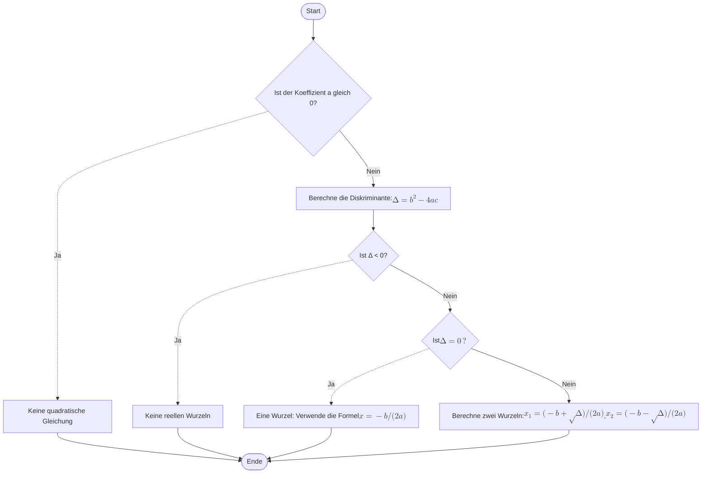

```mermaid
%% Mermaid Activity Diagram
flowchart TD
    A([Start]) --> B{Ist der Koeffizient a gleich 0?}
    B -.->|Ja| F[Keine quadratische Gleichung]
    B -->|Nein| C["Berechne die Diskriminante: $$Δ = b² - 4ac$$"]
    C --> E{Ist Δ < 0?}
    E -.->|Ja| G[Keine reellen Wurzeln]
    E -->|Nein| H{"Ist $$Δ = 0?$$"}
    H -.->|Ja| I["Eine Wurzel: Verwende die Formel $$x = -b / (2a)$$"]
    H -->|Nein| J["Berechne zwei Wurzeln:
        $$x₁ = (-b + √Δ) / (2a)$$,
        $$x₂ = (-b - √Δ) / (2a)$$"]
    F --> K([Ende])
    G --> K
    I --> K
    J --> K
```