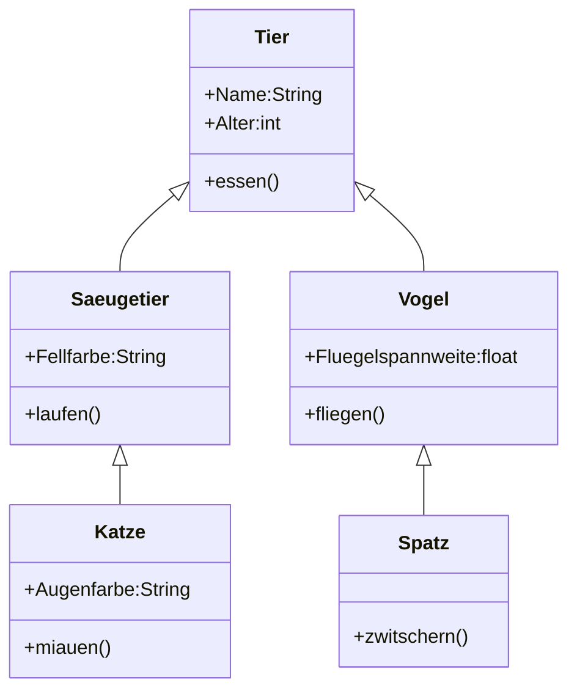
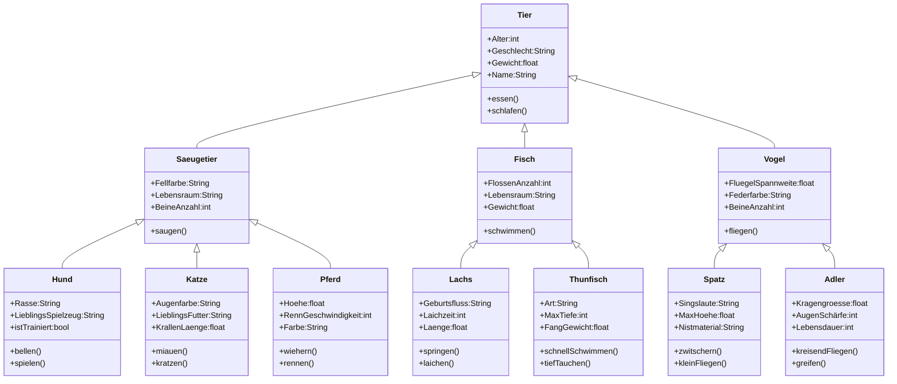
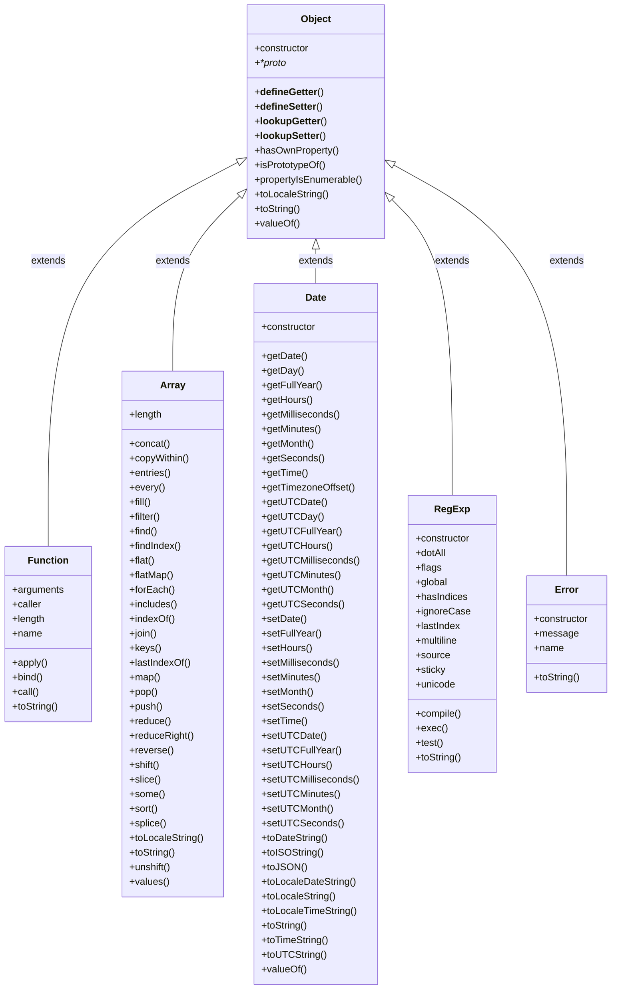
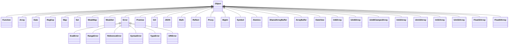

# Vererbung

Vererbung (Inheritance) ist ein grundlegendes Konzept in der objektorientierten Programmierung (OOP). Es beschreibt die Fähigkeit einer Klasse, die Eigenschaften und Methoden einer anderen Klasse zu übernehmen. Im Kontext von JavaScript kann Vererbung auf verschiedene Weisen umgesetzt werden, vor allem durch die Verwendung von `class` und `extends`.

- Basisklasse (Superklasse): Dies ist die Klasse, deren Eigenschaften und Methoden vererbt werden. Sie wird in JavaScript mit class definiert.
- Unterklasse (Subklasse): Dies ist die Klasse, die von einer anderen Klasse erbt und Zugriff auf deren Eigenschaften und Methoden hat. Die Vererbung erfolgt mit dem Schlüsselwort extends.

## Vorteile der Vererbung

- Wiederverwendbarkeit des Codes: Vererbung ermöglicht es, gemeinsamen Code in der Superklasse zu definieren und in den Subklassen wiederzuverwenden, was zu weniger Duplikation führt.
- Erweiterbarkeit: Subklassen können neue Methoden und Eigenschaften hinzufügen, wodurch die Funktionalität erweitert werden kann, ohne den Code der Basisklasse zu ändern.
- Klarheit und Organisation: Durch die Vererbung können verwandte Klassen logisch organisiert werden, was die Lesbarkeit und Wartbarkeit des Codes verbessert.

## Eigenschaften der Vererbung in JavaScript

- Konstruktor-Aufruf: Eine Unterklasse muss die Methode `super()` im Konstruktor aufrufen, um den Konstruktor der Basisklasse auszuführen.
- Überschreibung: Methoden der Superklasse können in der Unterklasse überschrieben werden, um spezifisches Verhalten zu definieren.
- Zugriff auf Superklassen-Methoden: Mit `super.methodName()` kann die Methode der Superklasse innerhalb der Unterklasse aufgerufen werden.




```js
// Basisklasse
class Tier {
constructor(name, alter) {
this.name = name;
this.alter = alter;
}
essen() {
console.log(`${this.name} isst.`);
}
}

// Unterklasse Saeugetier
class Saeugetier extends Tier {
constructor(name, alter, fellfarbe) {
super(name, alter);
this.fellfarbe = fellfarbe;
}
laufen() {
console.log(`${this.name} läuft.`);
}
}

// Unterklasse Katze
class Katze extends Saeugetier {
constructor(name, alter, fellfarbe, augenfarbe) {
super(name, alter, fellfarbe);
this.augenfarbe = augenfarbe;
}
miauen() {
console.log(`${this.name} miaut.`);
}
}

// Unterklasse Vogel
class Vogel extends Tier {
constructor(name, alter, fluegelspannweite) {
super(name, alter);
this.fluegelspannweite = fluegelspannweite;
}
fliegen() {
console.log(`${this.name} fliegt mit einer Flügelspannweite von ${this.fluegelspannweite} Metern.`);
}
}

// Spezifische Vogel-Unterklasse Spatz
class Spatz extends Vogel {
zwitschern() {
console.log(`${this.name} zwitschert fröhlich.`);
}
}

// Instanziierung der Katze-Klasse
const meineKatze = new Katze('Minka', 2, 'grau', 'grün');
meineKatze.essen(); // Ausgabe: "Minka isst."
meineKatze.miauen(); // Ausgabe: "Minka miaut."

// Instanziierung der Spatz-Klasse
const meinSpatz = new Spatz('Chirpy', 1, 0.25);
meinSpatz.essen(); // Ausgabe: "Chirpy isst."
meinSpatz.fliegen(); // Ausgabe: "Chirpy fliegt mit einer Flügelspannweite von 0.25 Metern."
meinSpatz.zwitschern(); // Ausgabe: "Chirpy zwitschert fröhlich."

```





# Standard-Hierarchie in Javascript





