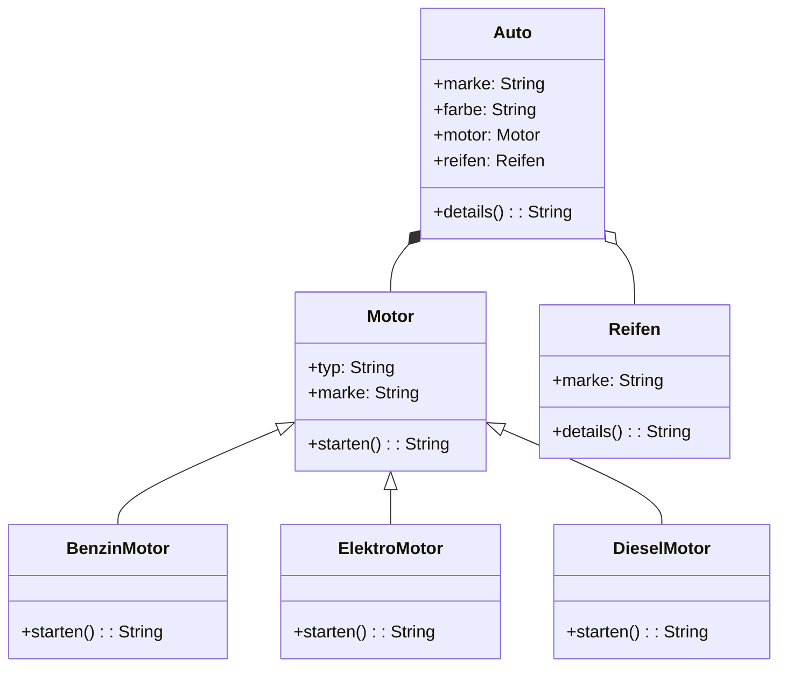

```mermaid
classDiagram
    class Motor {
        +typ: String
        +marke: String
        +starten(): String
    }
    class BenzinMotor {
        +starten(): String
    }
    class ElektroMotor {
        +starten(): String
    }
    class DieselMotor {
        +starten(): String
    }
    class Reifen {
        +marke: String
        +details(): String
    }
    class Auto {
        +marke: String
        +farbe: String
        +motor: Motor
        +reifen: Reifen
        +details(): String
    }

    Motor <|-- BenzinMotor
    Motor <|-- ElektroMotor
    Motor <|-- DieselMotor
    Auto *-- Motor
    Auto o-- Reifen
```