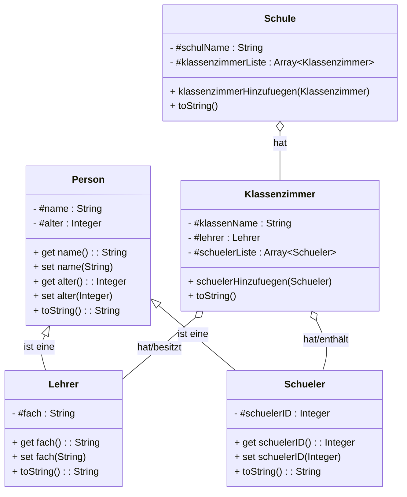

```mermaid
classDiagram
    class Person {
        - #name : String
        - #alter : Integer
        + get name() : String
        + set name(String)
        + get alter() : Integer
        + set alter(Integer)
        + toString() : String
    }

    class Lehrer {
        - #fach : String
        + get fach() : String
        + set fach(String)
        + toString() : String
    }

    class Schueler {
        - #schuelerID : Integer
        + get schuelerID() : Integer
        + set schuelerID(Integer)
        + toString() : String
    }

    class Klassenzimmer {
        - #klassenName : String
        - #lehrer : Lehrer
        - #schuelerListe : Array~Schueler~
        + schuelerHinzufuegen(Schueler)
        + toString()
    }

    class Schule {
        - #schulName : String
        - #klassenzimmerListe : Array~Klassenzimmer~
        + klassenzimmerHinzufuegen(Klassenzimmer)
        + toString()
    }

   
    Person <|-- Lehrer : ist eine
    Person <|-- Schueler : ist eine

   
    Klassenzimmer o-- Lehrer : hat/besitzt
    Klassenzimmer o-- Schueler : hat/enthält

  
    Schule o-- Klassenzimmer : hat

```