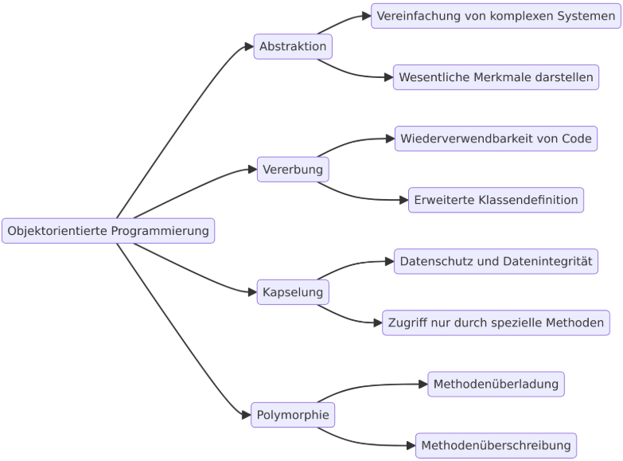

## Zugriffsmodifikatoren

Zugriffsmodifikatoren in JavaScript sind wichtig, um die Kapselung und Datenintegrität in Programmen zu gewährleisten. Hier sind die Hauptgründe, warum sie benötigt werden:

## Prinzipien von OOP

**Abstraktion**: Dies ist der Prozess, bei dem komplexe Systeme vereinfacht werden, indem nur die wesentlichen Merkmale eines Objekts dargestellt werden, während die unwesentlichen Details verborgen bleiben. So wird der Umgang mit Objekten vereinfacht und die Komplexität reduziert.

**Vererbung**: Hierbei handelt es sich um das Konzept, bei dem **eine Klasse Eigenschaften und Methoden einer anderen Klasse übernimmt**. Dies fördert die **Wiederverwendung von Code** und ermöglicht eine **hierarchische Klassendefinition**, bei der spezialisierte Klassen erweiterte oder angepasste Eigenschaften der Basisklasse erben.

Beispiel: Fahrzeug

**Kapselung**: Dies beschreibt das Verbergen der internen Zustände eines Objekts vor externen Zugriffen, um Datenintegrität zu gewährleisten. Nur bestimmte Methoden sind in der Lage, auf diese Daten zuzugreifen oder sie zu verändern. Dadurch wird eine klare Trennung zwischen der internen Implementierung und der Außenschnittstelle geschaffen.

**Polymorphie**: Diese Eigenschaft ermöglicht es, dass verschiedene Objekte auf die gleiche Weise verwendet werden können, auch wenn sie intern unterschiedlich funktionieren. Polymorphie kann sich durch Methodenüberladung (mehrere Methoden mit dem gleichen Namen, aber unterschiedlichen Parametern) oder durch Methodenüberschreibung (Subklassen implementieren eine Methode der Oberklasse neu) äußern.
