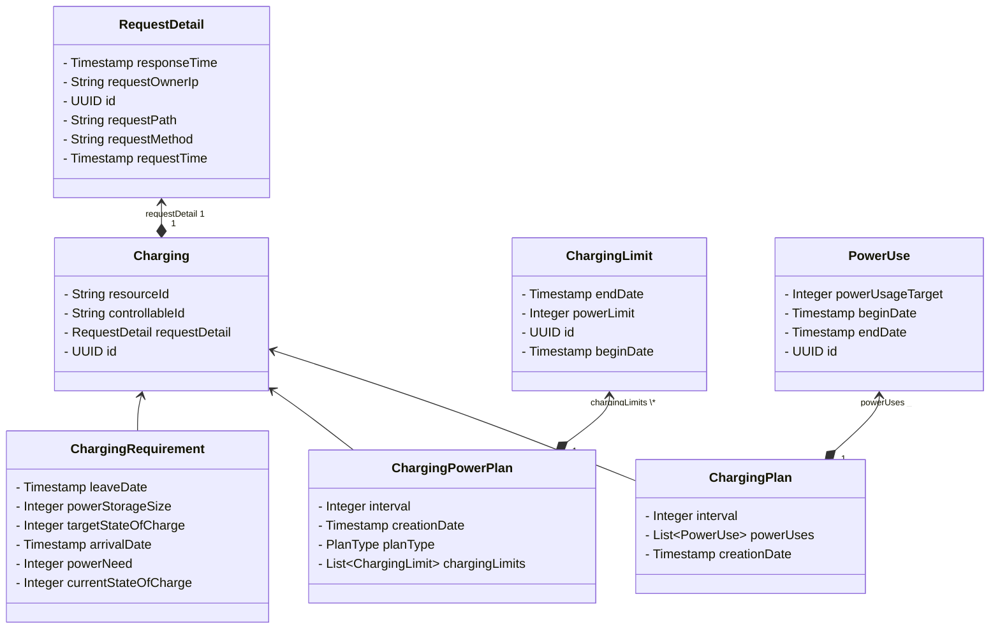

# Mermaid

```mermaid

classDiagram
direction BT
class Charging {

- String resourceId
- String controllableId
- RequestDetail requestDetail
- UUID id
  }
  class ChargingLimit {
- Timestamp endDate
- Integer powerLimit
- UUID id
- Timestamp beginDate
  }
  class ChargingPlan {
- Integer interval
- List~PowerUse~ powerUses
- Timestamp creationDate
  }
  class ChargingPowerPlan {
- Integer interval
- Timestamp creationDate
- PlanType planType
- List~ChargingLimit~ chargingLimits
  }
  class ChargingRequirement {
- Timestamp leaveDate
- Integer powerStorageSize
- Integer targetStateOfCharge
- Timestamp arrivalDate
- Integer powerNeed
- Integer currentStateOfCharge
  }
  class PowerUse {
- Integer powerUsageTarget
- Timestamp beginDate
- Timestamp endDate
- UUID id
  }
  class RequestDetail {
- Timestamp responseTime
- String requestOwnerIp
- UUID id
- String requestPath
- String requestMethod
- Timestamp requestTime
  }

Charging "1" *--> "requestDetail 1" RequestDetail
ChargingPlan --> Charging
ChargingPlan "1" *--> "powerUses _" PowerUse
ChargingPowerPlan --> Charging
ChargingPowerPlan "1" *--> "chargingLimits \*" ChargingLimit
ChargingRequirement --> Charging

```